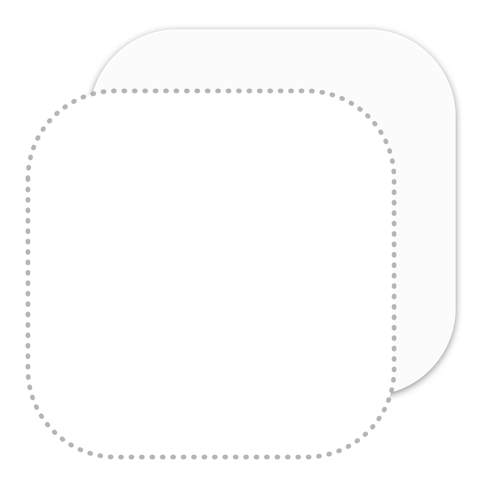

<p align="center">
    
</p>

<p align="center">
    
    
    
    <a href="https://twitter.com/danielsaidi">
        
    </a>
</p>


## About MockingKit

MockingKit is a Swift-based mocking library that makes it easy to mock protocols and classes, for instance when unit testing or mocking not yet implemented functionality.

MockingKit lets you `register` function results, `invoke` functions and `inspect` calls.

MockingKit doesn't put any restrains on your code or require you to structure it in any way. You don't need any setup or configuration. Just create a mock and you're good to go.


## Supported Platforms

MockingKit supports `iOS 13`, `macOS 10.15`, `tvOS 13` and `watchOS 6`.


## Installation

MockingKit can be installed with the Swift Package Manager:

```
https://github.com/danielsaidi/MockingKit.git
```

or with CocoaPods:

```
pod MockingKit
```

You can also clone the repository and build the library locally.


## Getting started

The online documentation has a [getting-started guide][Getting-Started] that will help you get started with the library.


## Documentation

The [online documentation][Documentation] has articles, code examples etc. that let you overview the various parts of the library.

The online documentation is currently iOS-specific. To generate documentation for other platforms, open the package in Xcode, select a simulator then run `Product/Build Documentation`. 


## Demo Application

This project contains a demo app that lets you explore MockingKit on iOS and macOS. To run it, just open and run `Demo/Demo.xcodeproj`.


## Support

You can sponsor this project on [GitHub Sponsors][Sponsors] or get in touch for paid support. 


## Contact

Feel free to reach out if you have questions or if you want to contribute in any way:

* E-mail: [daniel.saidi@gmail.com][Email]
* Twitter: [@danielsaidi][Twitter]
* Web site: [danielsaidi.com][Website]


## License

MockingKit is available under the MIT license. See the [LICENSE][License] file for more info.


[Email]: mailto:daniel.saidi@gmail.com
[Twitter]: http://www.twitter.com/danielsaidi
[Website]: http://www.danielsaidi.com
[Sponsors]: https://github.com/sponsors/danielsaidi

[Documentation]: https://danielsaidi.github.io/MockingKit/documentation/mockingkit/
[Getting-Started]: https://danielsaidi.github.io/MockingKit/documentation/mockingkit/getting-started
[License]: https://github.com/danielsaidi/MockingKit/blob/master/LICENSE
