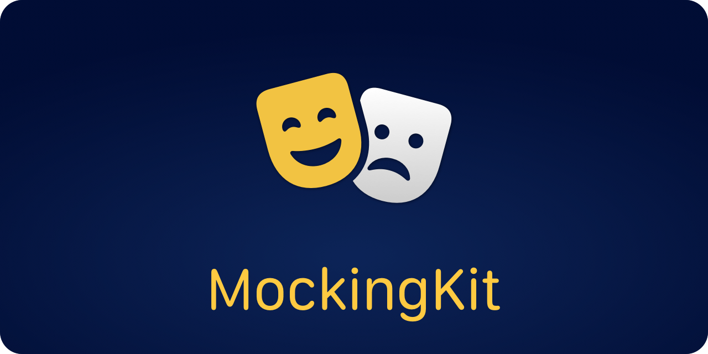

<p align="center">
    
</p>

<p align="center">
    
    
    
    
    <a href="https://twitter.com/danielsaidi"></a>
    <a href="https://mastodon.social/@danielsaidi"></a>
</p>


## About MockingKit

MockingKit lets you mock protocols and classes in `Swift`. This is useful when unit testing, or to fake functionality that is not yet implemented.

MockingKit lets you create mocks of any protocol or open class, after which you can `call` functions, `register` results, `record` method invocations, and `inspect` recorded calls.

MockingKit doesn't require any setup or build scripts, and puts no restrictions on your code or architecture. Just create a mock and you're good to go.


## Installation

MockingKit can be installed with the Swift Package Manager:

```
https://github.com/danielsaidi/MockingKit.git
```

If you prefer to not have external dependencies, you can also just copy the source code into your app.


## Getting started

MockingKit lets you create mocks of any protocol or open class.

For instance, consider this simple protocol:

```swift
protocol MyProtocol {

    func doStuff(int: Int, string: String) -> String
}
```

With MockingKit, you can easily create a mock implementation of this protocol: 

```swift
import MockingKit

class MyMock: Mock, MyProtocol {

    // Define a lazy reference for each function you want to mock
    lazy var doStuffRef = MockReference(doStuff)

    // Functions must then call the reference to be recorded
    func doStuff(int: Int, string: String) -> String {
        call(doStuffRef, args: (int, string))
    }
}
```

You can now use the mock to `register` function results, `call` functions and `inspect` recorded calls.

```swift
// Create a mock instance
let mock = MyMock()

// Register a result to be returned by doStuff
mock.registerResult(for: mock.doStuffRef) { args in String(args.1.reversed()) }

// Calling doStuff will now return the pre-registered result
let result = mock.doStuff(int: 42, string: "string") // => "gnirts"

// You can now inspect calls made to doStuff
let calls = mock.calls(to: \.doStuffRef)             // => 1 item
calls[0].arguments.0                                 // => 42
calls[0].arguments.1                                 // => "string"
calls[0].result                                      // => "gnirts"
mock.hasCalled(\.doStuffRef)                         // => true
mock.hasCalled(\.doStuffRef, numberOfTimes: 1)       // => true
mock.hasCalled(\.doStuffRef, numberOfTimes: 2)       // => false
```

To mock a class, you just have to subclass the class and implement the `Mockable` protocol:

```swift
import MockingKit

class MockUserDefaults: UserDefaults, Mockable {

    // You must provide a mock when implementing Mockable
    var mock = Mock()

    // You can now create lazy references just like in the protocol mock above
}
```

For more information, please see the [getting started guide][Getting-Started].


## Documentation

The [online documentation][Documentation] has more information, code examples, etc. 


## Demo Application

The demo app lets you explore the library on iOS and macOS. To try it out, just open and run the `Demo` project.


## Support my work 

You can [sponsor me][Sponsors] on GitHub Sponsors or [reach out][Email] for paid support, to help support my [open-source projects][GitHub].


## Contact

Feel free to reach out if you have questions or if you want to contribute in any way:

* Website: [danielsaidi.com][Website]
* Mastodon: [@danielsaidi@mastodon.social][Mastodon]
* Twitter: [@danielsaidi][Twitter]
* E-mail: [daniel.saidi@gmail.com][Email]


## License

MockingKit is available under the MIT license. See the [LICENSE][License] file for more info.


[Email]: mailto:daniel.saidi@gmail.com
[Website]: https://www.danielsaidi.com
[GitHub]: https://www.github.com/danielsaidi
[Twitter]: https://www.twitter.com/danielsaidi
[Mastodon]: https://mastodon.social/@danielsaidi
[Sponsors]: https://github.com/sponsors/danielsaidi

[Documentation]: https://danielsaidi.github.io/MockingKit/documentation/mockingkit/
[Getting-Started]: https://danielsaidi.github.io/MockingKit/documentation/mockingkit/getting-started
[License]: https://github.com/danielsaidi/MockingKit/blob/master/LICENSE
