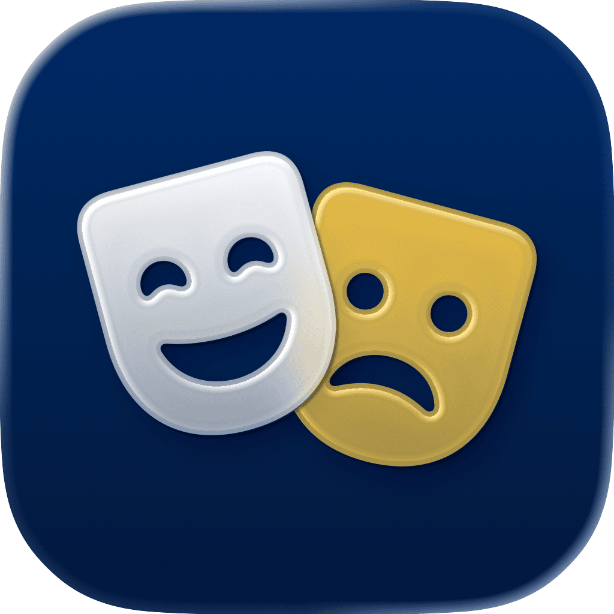

<p align="center">
    
</p>

<p align="center">
    
    
    <a href="https://danielsaidi.github.io/MockingKit"></a>
    
    <a href="https://github.com/sponsors/danielsaidi"></a>
</p>


# MockingKit

MockingKit is a mocking library for Swift that lets you create mocks of any protocol or class. This can be used to mock dependencies in unit tests, and to fake not yet implemented features in your apps.  

MockingKit automatically records every method call, to let you verify that your code behaves as you expect. You can also register register dynamic function results to control your test outcome.

MockingKit doesn't require any setup or build scripts, and puts no restrictions on your code or architecture. Just create a mock, set up how you want to use and inspect it, and you're good to go.


## Installation

MockingKit can be installed with the Swift Package Manager:

```
https://github.com/danielsaidi/MockingKit.git
```


## Support My Work

Maintaining my various [open-source tools][OpenSource] takes significant time and effort. You can [become a sponsor][Sponsors] to help me dedicate more time to creating, maintaining, and improving these projects. Every contribution, no matter the size, makes a real difference in keeping these tools free and actively developed. Thank you for considering!


## Getting started

MockingKit lets you mock any protocol or open class. For instance, consider this simple protocol:

```swift
protocol MyProtocol {

    func doStuff(int: Int, string: String) -> String
}
```

With MockingKit, you can easily create a mock implementation of this protocol: 

```swift
import MockingKit

class MyMock: Mock, MyProtocol {

    // Define a lazy reference for each function you want to mock
    lazy var doStuffRef = MockReference(doStuff)

    // Functions must then call the reference to be recorded
    func doStuff(int: Int, string: String) -> String {
        call(doStuffRef, args: (int, string))
    }
}
```

You can now use the mock to `register` function results, `call` functions and `inspect` recorded calls.

```swift
// Create a mock instance
let mock = MyMock()

// Register a result to be returned by doStuff
mock.registerResult(for: mock.doStuffRef) { args in String(args.1.reversed()) }

// Calling doStuff will now return the pre-registered result
let result = mock.doStuff(int: 42, string: "string") // => "gnirts"

// You can now inspect calls made to doStuff
let calls = mock.calls(to: \.doStuffRef)             // => 1 item
calls[0].arguments                                   // => (42, "string")
calls[0].result                                      // => "gnirts"
mock.hasCalled(\.doStuffRef)                         // => true
```

See the online [getting started guide][Getting-Started] for more information.


## Documentation

The online [documentation][Documentation] has more information, articles, code examples, etc. 


## Demo Application

The `Demo` folder has an app that lets you explore the library and see how its mocks behave.


## Contact

Feel free to reach out if you have questions or if you want to contribute in any way:

* Website: [danielsaidi.com][Website]
* E-mail: [daniel.saidi@gmail.com][Email]
* Bluesky: [@danielsaidi@bsky.social][Bluesky]
* Mastodon: [@danielsaidi@mastodon.social][Mastodon]


## License

MockingKit is available under the MIT license. See the [LICENSE][License] file for more info.


[Email]: mailto:daniel.saidi@gmail.com
[Website]: https://www.danielsaidi.com
[GitHub]: https://www.github.com/danielsaidi
[OpenSource]: https://danielsaidi.com/opensource
[Sponsors]: https://github.com/sponsors/danielsaidi

[Bluesky]: https://bsky.app/profile/danielsaidi.bsky.social
[Mastodon]: https://mastodon.social/@danielsaidi
[Twitter]: https://www.twitter.com/danielsaidi

[Documentation]: https://danielsaidi.github.io/MockingKit
[Getting-Started]: https://danielsaidi.github.io/MockingKit/documentation/mockingkit/getting-started
[License]: https://github.com/danielsaidi/MockingKit/blob/master/LICENSE
